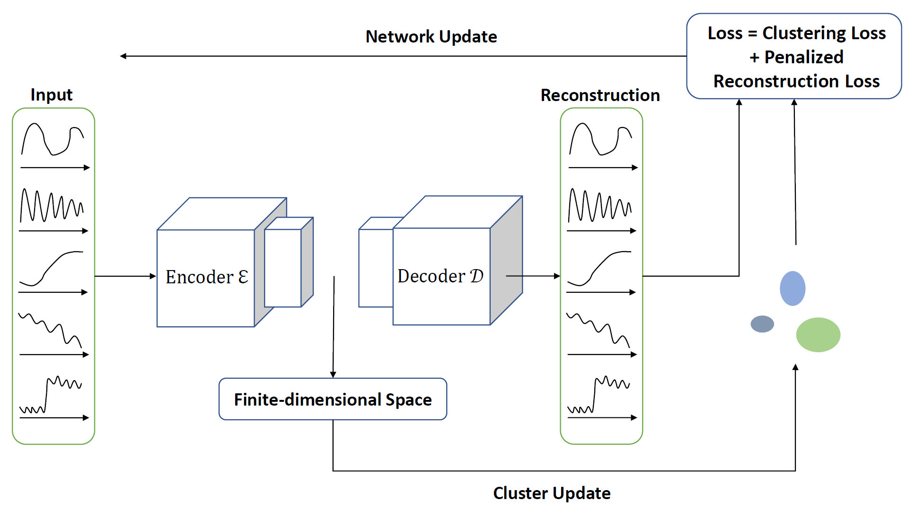
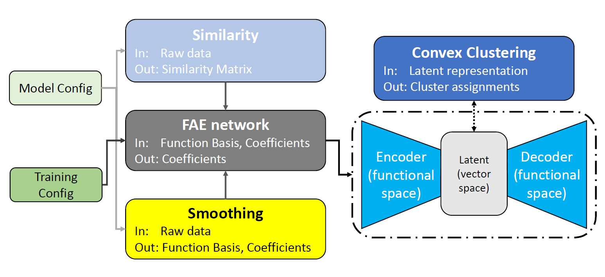

# FAEclust: Cluster Analysis of Multi-Dimensional Functional Data

Highlights:

* FAEclust is the first autoencoder architecture designed specifically for **clustering multi-dimensional functional data**. By using functional weights, it operates directly on functions rather than pointwise values, and its deep structure automatically captures complex dependencies among the component random functions.
*  Both the encoder and decoder are **universal approximators**.
* We introduce a shape-informed clustering objective that is **robust to phase variation** in functional data, and we develop a path-following homotopy algorithm with complexity O(n log(n)) to obtain the optimal clustering of the latent representations.

In FAEclust, we employ univariate functions as weights instead of integral kernels:

1. Unlike traditional regression models, where integral kernels are used for functional predictors to capture full dependence, our encoder is designed to learn latent representations. Consequently, the univariate functions serve as a coordinate system in the Hilbert space.
2. Using univariate functions not only reduces computational cost but also improves interpretability. In particular, the shape of the learned functional weights reveals which regions of the input functional data contribute most to the construction of the embedded representations.


## 🏗️ The joint network training and clustering framework.



  1. **Network Update**: In the backward phase, we update the network parameters by minimizing a unified objective function (**Loss**) that incorporates both the network training objective (**Penalized Reconstruction Loss**) and the clustering regularization (**Clustering Loss**).
  2. **Cluster Update**: During the forward phase, we update the learned latent representations, which necessitates a concurrent update of the clustering results. 

## 🛠️ Core Modules

The modular pipeline for FAEclust has the following structure:



1. **Similarity**: Compute pairwise (elastic) distances with `TimeSeriesDistance()`, identify the optimal number of nearest neighbors (`m` in the paper) via `NearestNeighborsOpt()`, and finally compute pairwise similarity measures.
2. **Smoothing**: Convert raw curves into basis functions and expansion coefficients via `smoothing_features()`. 
3. **FAE network**: Configure and train the functional network via `FunctionalAutoencoder()`.
4. **Convex Clustering**: Cluster analysis of the latent representations, where the clustering objective function is a convex function.

----------

## Class: Smoothing
 
**Smoothing** is a utility class that implements the smoothing step. It supports B-spline, Fourier series, and Wavelet-based smoothing. This class is used internally by `smoothing_features()`.
 
```python

Smoothing(
    dis_p, 		# number of grid points for evaluating functions 
    fit, 		# basis function type: 'bspline', 'fourier', or Wavelet name 
    n, 			# for Fourier: number of harmonics (2n+1 basis functions) 
    smoothing_str,	# initial smoothing parameter for B-splines if _terms_ is not given
    terms, 		# number of basis terms/knots to use (if None, auto-optimize) 
    wavelet_level, 	# Wavelet decomposition level (for Wavelet fits) if _terms_ is not given
    data = None  	# input data of shape (n_samples, n_timesteps)
) 

```
 
### Parameters
 
-   **`dis_p`** _(int)_:  Number of grid points for evaluating functions.     _Default_: `300`

-   **`fit`** _(str)_:  The type of basis expansion to use for smoothing. Options are the same as in `smoothing_features`: `'bspline'`, `'fourier'`, or a Wavelet name (e.g., `'db4'`).     _Default_: `'bspline'`

-   **`n`** _(int)_:  Applicable if `fit='fourier'`. It specifies the number of Fourier harmonics to include. The total number of Fourier basis functions will be $2n + 1$ (including the constant term, $n$ cosine terms, and $n$ sine terms). If `n=None`,  the smoothing is adaptive and Generalized Cross-Validation (GCV) is used to find the optimal number of harmonics up to `n` by GCV.    _Default_: `3` 

-   **`smoothing_str`** _(float)_:  Parameters for B-spline fitting. This is passed to the spline fitting routine (`scipy.interpolate.splrep()`) to control the trade-off between smoothness and fidelity: higher values yield smoother curves (more regularization), while _s_=0 fits the spline through all points (interpolation). If `terms` (number of knots/basis functions) is not specified for B-splines, this parameter is internally optimized via GCV.      _Default_: `0.3`

-   **`terms`** _(int or None)_:  Applicable if `fit='bspline'`. The number of basis functions or knots to use. If `terms=None`, the smoothing is adaptive and class will attempt GCV to find the optimum fit and the corresponding terms.  _Default_: `None`

-   **`wavelet_level`** _(int)_:  The level of decomposition for Wavelet smoothing. Higher levels capture coarser structures. If `terms=None`, and `fit` is a Wavelet, the code attempts to find an optimal level via GCV.      _Default_: `5` 

-   **`data`** _(np.ndarray, shape (n_samples, n_features, n_timesteps))_:  The raw sample paths to smooth.
 
### Returns
 
-   **`coeffs`** _(np.ndarray, shape=(n_samples, n_features, m_basis))_:  Array of basis expansion coefficients. 

-   **`fn_s`** _(list of callables)_:  List of the smoothed functions evaluated/defined on the time grid.

-   **`smoothing_basis`** _(list of callables)_:  The list of basis functions used for smoothing the raw sample paths.
 


## Class: TimeSeriesDistance

**TimeSeriesDistance** computes the pairwise distance matrix for the raw sample paths.

```python
TimeSeriesDistance(
    X, 			# raw sample paths of shape (n_samples, n_features, n_timesteps)
    metric,             # distance metric to use ('fastdtw' or 'elastic') 
    n_jobs  		# number of parallel jobs for computation 
) 
```
### Parameters

-   **`X`** _(np.ndarray, shape=(n_samples, n_features, n_timesteps))_:  An array containing the raw multi-dimensional functional data. Functional data should be standardized before distance computation to ensure comparability.
    
-   **`metric`** _(str)_:  Metric to use for distance computation. Options include:
    
    -   `'fastdtw'`: Distance measure using the dynamic time warping method. 
        
    -   `'elastic'` _(default)_: The elastic distance metric. 
        
-   **`n_jobs`** _(int)_:  Number of parallel jobs for computation.    _Default_: `-1` 

### Methods
- **`compute_distances(self)`**: Compute the pairwise distance matrix.
	- **Returns**
		- **`dist_matrix`**  _(np.ndarray, shape (n_samples, n_samples))_ : The pairwise distance matrix. 

- **`plot_extremes(self)`**: Visualise the pair of most similar and the most distinct samples. 
	- **Returns**
		- **`None`**.


## Class: NearestNeighborsOpt

**NearestNeighborsOpt** is a utility class for determining the optimal number of nearest neighbors (`m`) used in the pairwise similarity measure of the clustering objective function. Given a pairwise distance matrix, it examines how the structure of the k-nearest neighbor graph evolves as k varies, using two complementary criteria: the distance "knee" and graph connectivity.

```python
NearestNeighborsOpt(
    dist_matrix 			# pairwise distance matrix of shape=(n_samples, n_samples)
) 
```

### Parameters

- **`dist_matrix`**  _(np.ndarray, shape (n_samples, n_samples))_ :  Distance matrix returned by **`TimeSeriesDistance()`**. 
    

### Methods
-   **`estimate_optimal_m(method='connectivity', max_m=None)`**: Select the optimal number of nearest neighbors.
    -  **`method`** _(str)_ : Method to use for neighbourhood optimization. Options include:
	    -  **`'avg_distance'`** _(default)_ : Find the $m$ at which the average _m_-th neighbor distance exhibits the largest jump or knee.
	    -   **`'connectivity'`** : Find the smallest $m$ at which the _k_-NN graph is fully connected. 
    -  **`max_m`** _(int)_ : Maximum number of neighbors to consider. _Default_ `max_m=n_samples-1`
    - **Returns** 
	    - **`m`**  _(int)_ : The optimum number of nearest neighbors.
    
-   **`get_nearest_neighbors(opt_m=m)`**: Construct the adjacency list (neighbor index list) for each data point given the neighborhood value `m`.
	-  **`m`**  _(int)_: Estimated using `estimate_optimal_m()`. 
	-  **Returns** 
		- **`neighbors_dict`** _(dict)_ : A dictionary mapping each data point to its `m` nearest neighbors.
    
-   **`compute_similarity(neighbors_dict)`**: Calculate the pairwise similarities from the distance matrix and the  the _k_-NN graph.
    - **`neighbors_dict`** _(dict)_ : ...
    - **Returns** 
	    - **`sim_matrix`** _(np.ndarray, shape (n_samples, n_samples))_: The pairwise similarity matrix (n×n).
        


## Class: FunctionalAutoencoder

FAEclust is a deep learning framework for clustering multivariate functional data. It integrates three key components: (1) functional data smoothing via basis function expansion (e.g. B-splines, Fourier series, Wavelet family, ...) to provide a smooth representation of each sample path, (2) a functional autoencoder consisting of an encoder for learning complex relationships among the features and a decoder for flexibly reconstructing intricate functional patterns, and (3) a shape-informed convex clustering algorithm that automatically determines the optimal number of clusters.  The `FunctionalAutoencoder` class is designed to handle these steps end-to-end,  while providing various hyperparameters to tailor the model to different datasets.

```python
FunctionalAutoencoder(
    p,                      # number of component random functions (dimensions)
    layers,                 # list specifying encoder/decoder layer width
    l,                      # number of basis functions for encoder functional weights
    m,                      # number of basis functions for smoothing the sample paths
    basis_smoothing,        # list of basis functions used for smoothing (e.g. Fourier basis)
    basis_input,            # list of basis functions for encoder functional weights (e.g. B-spline basis)
    lambda_e,               # penalty parameter for the orthogonality regularization on encoder functional weights
    lambda_d,               # penalty parameter for the roughness regularization on encoder functional weights and biases
    lambda_c,               # penalty parameter for the clustering loss in the integrated objective function
    t,                      # time grid (array of length T) over which the smoothed functions are evaluated
    sim_matrix              # pairwise similarity matrix (n×n) in the clustering objective function
)

```

### Parameters

-   **`p`** _(int)_ – Number of component random functions (dimensions). For example, `p=2` for two-dimensional functional data.
    
-   **`layers`** _(list of int)_ – Architecture specification for the autoencoder’s layers. This list should include the width of each encoder layer, the latent dimension, and the width of each decoder layer. The format is **`[q1, q2, ..., s, ..., Q2, Q1, Z1, Z2]`**, where:
    
    -   _`q1`_ is the number of nodes in the encoder's first hidden layer.
        
    -   _`q2, ..., s`_ are the sizes of the successive hidden layers in the encoder, with _`s`_ being the final **latent dimension** (the size of the bottleneck vector).
        
    -   _`..., Q2`_ are the sizes of the dense layers in the decoder (mirroring the encoder’s dense layers).
        
    -   _`Q1, Z1, Z2`_ are the sizes of the last three layers of the decoder that output functions. 
        
-   **`l`** _(int)_ – Functional weights and biases are represented as linear combinations of basis functions. `l` is the number of basis functions for the functional weights in the encoder.
    
-   **`m`** _(int)_ – Number of basis functions used for converting the raw sample paths into smooth functions.
    
-   **`basis_smoothing`** _(list of callables)_ – A list of `m` basis functions (evaluated on the time grid `t`) for smoothing the raw sample paths. The provided utility `smoothing_features()` can generate this list along with the expansion coefficients.
    
-   **`basis_input`** _(list of callables)_ – A list of `l` basis functions (evaluated on the time grid `t`) for representing the functional weights in the encoder. 
    
-   **`lambda_e`** _(float)_ – Penalty parameter for the orthogonality regularization on encoder functional weights. The parameter controls the amount of regularization on encoder functional weights, encouraging within-component functional weights to be orthogonal.
    
-   **`lambda_d`** _(float)_ – Penalty parameter for the roughness regularization on encoder functional weights and biases. The parameter controls the amount of smoothness of the encoder functional weights and biases.
    
-   **`lambda_c`** _(float)_ –Penalty parameter for the clustering loss in the integrated objective function.  A higher `lambda_c` places more emphasis on forming well-separated clusters in the latent space (at the potential cost of reconstruction accuracy). 
    
-   **`t`** _(array-like of shape (T,))_ – Time grid (array of length T) over which the input functions, functional weights, functional biases and output functions are evaluated/defined. 
    
-   **`sim_matrix`** _(numpy.ndarray of shape (n_samples, n_samples))_ – The pairwise similarity matrix among the $$ sample paths, a term in the clustering objective function. The similarity matrix is essentially a weighted `m`-nearest neighbor graph, and the function `NearestNeighborsOpt()` will construct the graph with the optimal `m` value. 
    

### Methods
- **`model_summary(self)`**: A generic function used to produce a summary of the trained model. 
	- **Returns**
		- **`None`** 

-   **`train(self, coeffs, epochs, learning_rate, batch_size, neighbors_dict, sim_matrix)`** :  Model training is performed using the mini-batch gradient descent with momentum. 
	-   **`epochs`** _(int)_ – Number of training epochs (full passes over the dataset). 		 _Default_: `100` 
	-   **`learning_rate`** _(float)_ – Learning rate of the training algorithm. A smaller value might be used if the loss oscillates or diverges, whereas a larger value could speed up convergence if the loss is stable. 		_Default_: `1e-3` 
    -   **`batch_size`** _(int)_ – The mini-batch size.	    _Default_: `16` 
    -   **`neighbors_dict`** _(dict)_   A dictionary mapping each data point to its `m` nearest neighbors. It is obtained from the `get_nearest_neighbors()` method. 
    - **`sim_matrix`**_(numpy.ndarray of shape (n_samples, n_samples))_ – The pairwise similarity matrix among the $$ sample paths.

- **`predict(coeffs, batch_size=batch_size)`**: Return the embedded data and the cluster labels of the functional data.
	- **Returns**
		- **`S`** _(np.ndarray, shape=(n_samples, s))_ : Array of the embedded data.
		- **`labels`** _(np.ndarray, shape=(n_samples))_ : Functional data cluster labels.


## Class: ConvexClustering
 
**ConvexClustering** is the path-following homotopy algorithm that produces a hierarchy of clusters and determines the optimal number of clusters via an internal validation metric.
 
```python
ConvexClustering(
    X, 				# embedded data of shape (n_samples, s) 
    neighbors_dict, 		 
    sim_matrix, 		# the pairwise similarity matrix
    verbose		  	# whether to print out the merging process and the Silhouette scores 
)
```
### Parameters
 
-   **`X`** _(np.ndarray, shape=(n_samples, s))_ – The embedded data in the latent space. 
-   **`neighbors_dict`** _(dict)_:  ... 
-   **`sim_matrix`** _(np.ndarray, shape (n_samples, n_samples))_ – ...
-   **`verbose`** _(bool, optional)_:  If `True`, the algorithm will print out the hierarchy of clusters and the corresponding Silhouette scores.     _Default_: `False`
 
### Methods
- **`fit(self)`**: Perform clustering on the embedded data. 
	- **Returns**
		- **`cluster_labels`** _(np.ndarray, shape=(n_samples))_ : The (optimal) cluster labels.


---
## Code Example

### Example 1: Clustering Synthetic Data

Below is an example of using FAEclust on a simulated dataset (the pendulum dataset in the paper). 

[🔗 view the full notebook](simulation.ipynb)

We compute the similarity matrix using the elastic distance (`metric='elastic'`).  After smoothing the data with B-spline basis functions, we configure a functional autoencoder with an encoder-decoder architecture (16 → 8 → 4 (latent) → 8 → 16 → 16 → 16 with functional layers of size 16 at both ends). We train the model for 150 epochs. The output `labels` from `predict` are the cluster assignments found by the path-following homotopy algorithm. We print the Adjusted Rand Index (ARI) and Adjusted Mutual Information (AMI) to evaluate how well the predicted clusters match the true clusters (`y_true`). 

### Example 2: Clustering Real Data

In this example, we demonstrate FAEclust on the `"Plane"` dataset using a similar workflow: similarity computation, smoothing, and clustering via the functional autoencoder.

[🔗 view the full notebook](test.ipynb)

We compute the similarity matrix using FastDTW (`metric='fastdtw'`). After building the similarity matrix, we smooth each sample path with B-spline basis functions. The functional autoencoder is configured with the architecture: `[32, 16, 8, 16, 32, 32, 32]` which produces a latent representation of dimension 8. After 100 epochs, we obtain the final cluster labels.

The above examples and parameters serve as a guide, but users are encouraged to experiment with the basis size (`l, m`), network depth (`layers`), and loss weights (`lambda_e, lambda_d, lambda_c`) to best fit their specific datasets.


