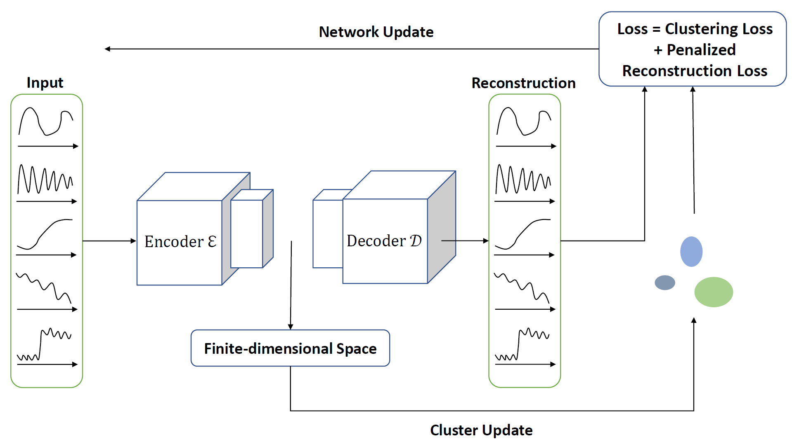
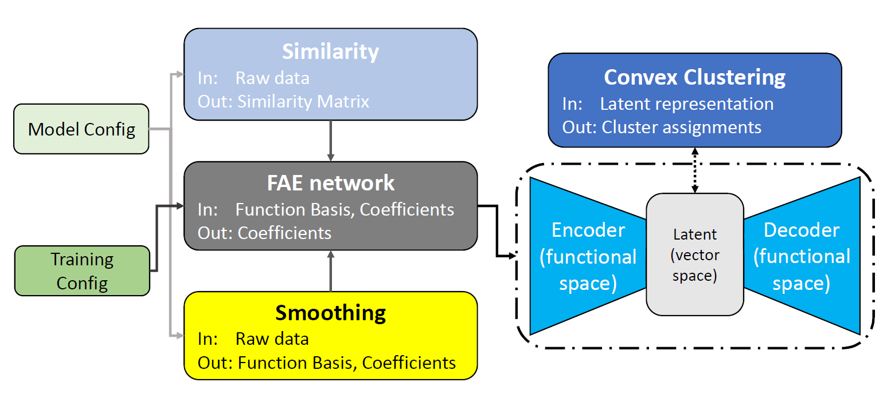

# FAEclust: Cluster Analysis of Multi-Dimensional Functional Data

FAEclust is the first autoencoder architecture designed specifically for **clustering multi-dimensional functional data**. In FAEclust, we employ univariate functions as weights instead of integral kernels:

1. Unlike traditional regression models, where integral kernels are used for functional predictors to capture full dependence, our encoder is designed to learn latent representations. Consequently, the univariate functions serve as a coordinate system in the Hilbert space.
2. Using univariate functions not only reduces computational cost but also improves interpretability. In particular, the shape of the learned functional weights reveals which regions of the input functional data contribute most to the construction of the embedded representations.

Both the encoder and decoder are **universal approximators**. We introduce a shape-informed clustering objective that is **robust to phase variation** in functional data, and we develop a path-following homotopy algorithm with complexity O(n log(n)) to obtain the optimal clustering of the latent representations. If you used this package in your research, please cite our [paper](https://arxiv.org/abs/2509.22969):
```latex
@inproceedings{SVS2025NeurIPS,
 author = {Samuel Singh and Shirley Coyle and Mimi Zhang},
 booktitle = {Advances in Neural Information Processing Systems (NeurIPS)},
 editor = { },
 pages = { },
 publisher = {Curran Associates, Inc.},
 title = {Shape-Informed Clustering of Multi-Dimensional Functional Data via Deep Functional Autoencoders},
 volume = { },
 year = {2025}
}
```


## 🏗️ The joint network training and clustering framework.



  1. **Network Update**: In the backward phase, we update the network parameters by minimizing a unified objective function (**Loss**) that incorporates both the network training objective (**Penalized Reconstruction Loss**) and the clustering regularization (**Clustering Loss**).
  2. **Cluster Update**: During the forward phase, we update the learned latent representations, which necessitates a concurrent update of the clustering results. 

## 🛠️ Core Modules

The modular pipeline for FAEclust has the following structure:



1. **Similarity**: Compute pairwise (elastic) distances with `TimeSeriesDistance()`, identify the optimal number of nearest neighbors (`m` in the paper) via `NearestNeighborsOpt()`, and finally compute pairwise similarity measures.
2. **Smoothing**: Convert raw curves into basis functions and expansion coefficients via `smoothing_features()`. 
3. **FAE network**: Configure and train the functional network via `FunctionalAutoencoder()`.
4. **Convex Clustering**: Cluster analysis of the latent representations, where the clustering objective function is a convex function (`ConvexClustering()`).

> A one-call convenience, `run_experiment()`, runs this whole pipeline on a built-in synthetic dataset, and an optional `tuning` utility performs Optuna hyperparameter search. See [Convenience Utilities](#convenience-utilities) below.

----------

## Class: Smoothing
 
**Smoothing** is a utility class that implements the smoothing step. It supports B-spline, Fourier series, and Wavelet-based smoothing. This class is used internally by `smoothing_features()`.
 
```python

Smoothing(
    dis_p,			# number of grid points for evaluating functions 
    fit,			# basis function type: 'bspline', 'fourier', or a Wavelet name 
    n,				# for Fourier: number of harmonics (2n+1 basis functions) 
    smoothing_str,	# initial smoothing parameter for B-splines if _terms_ is not given
    terms,			# number of basis terms/knots to use (if None, auto-optimize) 
    wavelet_level,	# Wavelet decomposition level (for Wavelet fits) if _terms_ is not given
    data = None		# input data of shape (n_samples, n_timesteps)
) 

```
 
### Parameters
 
-   **`dis_p`** _(int)_:  Number of grid points for evaluating functions.     _Default_: `300`

-   **`fit`** _(str)_:  The type of basis expansion to use for smoothing. Options are the same as in `smoothing_features`: `'bspline'`, `'fourier'`, or a Wavelet name (e.g., `'db4'`).     _Default_: `'bspline'`

-   **`n`** _(int)_:  Applicable if `fit='fourier'`. It specifies the number of Fourier harmonics to include. The total number of Fourier basis functions will be $2n + 1$ (including the constant term, $n$ cosine terms, and $n$ sine terms). If `n=None`,  the smoothing is adaptive and Generalized Cross-Validation (GCV) is used to find the optimal number of harmonics.    _Default_: `3` 

-   **`smoothing_str`** _(float)_:  Parameter for B-spline fitting. When `terms` (number of knots/basis functions) is not specified for B-splines, it is used as the initial scale of the penalty $\lambda$ in the GCV search controlling the trade-off between smoothness and fidelity: higher values yield smoother curves (more regularization).      _Default_: `0.3`

-   **`terms`** _(int or None)_:  Applicable if `fit='bspline'`. The number of basis functions or knots to use. If `terms=None`, the smoothing is adaptive and the class will attempt GCV to find the optimum fit and the corresponding terms.  _Default_: `None`

-   **`wavelet_level`** _(int)_:  The level of decomposition for Wavelet smoothing. Higher levels capture coarser structures. If `terms=None`, and `fit` is a Wavelet, the code attempts to find an optimal level via GCV.      _Default_: `4` 

-   **`data`** _(np.ndarray, shape (n_samples, n_timesteps))_:  The raw sample paths to smooth (one feature dimension at a time).
 
### Returns
 
-   **`coeffs`** _(np.ndarray)_:  Array of basis expansion coefficients. 

-   **`fn_s`** _(list of callables)_:  List of the smoothed functions evaluated/defined on the time grid.

-   **`smoothing_basis`** _(list of callables)_:  The list of basis functions used for smoothing the raw sample paths.
 

> **Tip:** in practice you call `smoothing_features(data, m=..., dis_p=..., fit=..., standardize=True)`, which applies `Smoothing` across every feature dimension and returns `(coeffs, curves, basis_smoothing)` ready for the autoencoder. The optional `standardize=True` applies per-component functional standardization (manuscript Appendix A).


## Class: TimeSeriesDistance

**TimeSeriesDistance** computes the pairwise distance matrix for the raw sample paths.

```python
TimeSeriesDistance(
    X,				# raw sample paths of shape (n_samples, n_features, n_timesteps)
    metric,			# distance metric ('elastic', 'elastic-fast', 'fastdtw', 'ultrafast') 
    n_jobs,			# number of parallel jobs for computation 
    band_radius,	# Sakoe-Chiba band radius (None = auto) 
    elastic_coarse_factor	# coarse downsampling ratio for 'elastic-fast'
) 
```
### Parameters

-   **`X`** _(np.ndarray, shape=(n_samples, n_features, n_timesteps))_:  An array containing the raw multi-dimensional functional data. The class internally standardizes each feature dimension before distance computation to ensure comparability.
    
-   **`metric`** _(str)_:  Metric to use for distance computation. Options include:
    
    -   `'elastic'` _(default)_: the true Fisher–Rao elastic distance (SRVF + dynamic programming), JIT-compiled and optionally banded. Phase-invariant.
        
    -   `'elastic-fast'`: multi-resolution elastic — coarse DP + banded refinement; quasi-O(N) with near-DP accuracy.
        
    -   `'fastdtw'`: band-constrained dynamic time warping, O(N).
        
    -   `'ultrafast'`: multi-resolution recursive FastDTW, ~O(N).
        
-   **`n_jobs`** _(int)_:  Number of parallel jobs for computation.    _Default_: `-1` 

-   **`band_radius`** _(int or None)_:  Sakoe–Chiba band radius. When `None`, it auto-scales to `max(12, n_timesteps // 4)`. Pass `-1` to disable banding for the `'elastic'` DP.    _Default_: `None`

-   **`elastic_coarse_factor`** _(int)_:  Downsampling ratio for the coarse stage of `'elastic-fast'`.    _Default_: `2`

### Methods
- **`compute_distances(self)`**: Compute the pairwise distance matrix.
	- **Returns**
		- **`dist_matrix`**  _(np.ndarray, shape (n_samples, n_samples))_ : The pairwise distance matrix. 

- **`plot_extremes(self)`**: Visualise the pair of most similar and the most distinct samples. 
	- **Returns**
		- **`None`**.


## Class: NearestNeighborsOpt

**NearestNeighborsOpt** is a utility class for determining the optimal number of nearest neighbors (`m`) used in the pairwise similarity measure of the clustering objective function. Given a pairwise distance matrix, it examines how the structure of the k-nearest neighbor graph evolves as k varies, using two complementary criteria: graph connectivity and the distance "knee".

```python
NearestNeighborsOpt(
    dist_matrix			# pairwise distance matrix of shape=(n_samples, n_samples)
) 
```

### Parameters

- **`dist_matrix`**  _(np.ndarray, shape (n_samples, n_samples))_ :  Distance matrix returned by **`TimeSeriesDistance()`**. 
    

### Methods
-   **`estimate_optimal_m(method='connectivity', max_m=None)`**: Select the optimal number of nearest neighbors.
    -  **`method`** _(str)_ : Method to use for neighbourhood optimization. Options include:
	    -   **`'connectivity'`** _(default)_ : Find the smallest $m$ at which the _k_-NN graph is fully connected (a single component). This is the robust default used throughout the examples.
	    -  **`'avg_distance'`** : Find the $m$ at which the average _m_-th neighbor distance exhibits the largest relative jump (searched in the informative early window).
    -  **`max_m`** _(int)_ : Maximum number of neighbors to consider. _Default_ `max_m=n_samples-1`
    - **Returns** 
	    - **`m`**  _(int)_ : The optimum number of nearest neighbors.
    
-   **`get_nearest_neighbors(opt_m=m)`**: Construct the adjacency list (neighbor index list) for each data point given the neighborhood value `m`.
	-  **`opt_m`**  _(int)_: Estimated using `estimate_optimal_m()`. 
	-  **Returns** 
		- **`neighbors_dict`** _(dict)_ : A dictionary mapping each data point to its `m` nearest neighbors.
    
-   **`compute_similarity(neighbors_dict, method='neighbors')`**: Compute the pairwise similarities from the distance matrix and the _k_-NN graph, following the manuscript (Section 4.1): $s(y_i, y_j) = \mathbb{1}[\, y_j \in N_m(y_i) \text{ or } y_i \in N_m(y_j) \,]\cdot \exp(-d(y_i, y_j))$.
    - **`neighbors_dict`** _(dict)_ : Mapping `i -> indices of i's m nearest neighbours`.
    - **Returns** 
	    - **`sim_matrix`** _(np.ndarray, shape (n_samples, n_samples))_: The pairwise similarity matrix (n×n).
        


## Class: FunctionalAutoencoder

FAEclust is a deep learning framework for clustering multivariate functional data. It integrates three key components: (1) functional data smoothing via basis function expansion (e.g. B-splines, Fourier series, Wavelet family, ...) to provide a smooth representation of each sample path, (2) a functional autoencoder consisting of an encoder for learning complex relationships among the features and a decoder for flexibly reconstructing intricate functional patterns, and (3) a shape-informed convex clustering algorithm that automatically determines the optimal number of clusters.  The `FunctionalAutoencoder` class is designed to handle these steps end-to-end,  while providing various hyperparameters to tailor the model to different datasets.

```python
FunctionalAutoencoder(
    p,                      # number of component random functions (dimensions)
    layers,                 # list specifying encoder/decoder layer widths
    l,                      # number of basis functions for encoder functional weights
    m,                      # number of basis functions for smoothing the sample paths
    basis_smoothing,        # list of basis functions used for smoothing (e.g. Fourier basis)
    basis_input,            # list of basis functions for encoder functional weights (e.g. B-spline basis)
    lambda_e,               # penalty parameter for the orthogonality regularization on encoder functional weights
    lambda_d,               # penalty parameter for the roughness regularization on encoder functional weights and biases
    lambda_c,               # penalty parameter for the clustering loss in the integrated objective function
    t,                      # time grid (array of length T) over which the smoothed functions are evaluated
    sim_matrix,             # pairwise similarity matrix (n×n) in the clustering objective function
    tau = 1.0,              # dropout keep-probability for the MLP layers (1.0 = off)
    use_bn = True,          # batch-normalisation in the MLP layers
    manifold = None,        # decoder readout: None | 'euclidean' | 'sphere' | 'poincare'
    seed = 0                # RNG seed for reproducible initialisation & shuffling
)

```

### Parameters

-   **`p`** _(int)_ – Number of component random functions (dimensions). For example, `p=2` for two-dimensional functional data.
    
-   **`layers`** _(list of int)_ – Architecture specification for the autoencoder’s layers. This list should include the width of each encoder layer, the latent dimension, and the width of each decoder layer. The format is **`[q1, q2, ..., s, ..., Q2, Q1, Z1, Z2]`**, where:
    
    -   _`q1`_ is the number of nodes in the encoder's first hidden layer.
        
    -   _`q2, ..., s`_ are the sizes of the successive hidden layers in the encoder, with _`s`_ being the final **latent dimension** (the size of the bottleneck vector).
        
    -   _`..., Q2`_ are the sizes of the dense layers in the decoder (mirroring the encoder’s dense layers).
        
    -   _`Q1, Z1, Z2`_ are the sizes of the last three layers of the decoder that output functions. 
        
-   **`l`** _(int)_ – Functional weights and biases are represented as linear combinations of basis functions. `l` is the number of basis functions for the functional weights in the encoder.
    
-   **`m`** _(int)_ – Number of basis functions used for converting the raw sample paths into smooth functions.
    
-   **`basis_smoothing`** _(list of callables)_ – A list of `m` basis functions (evaluated on the time grid `t`) for smoothing the raw sample paths. The provided utility `smoothing_features()` can generate this list along with the expansion coefficients.
    
-   **`basis_input`** _(list of callables)_ – A list of `l` basis functions (evaluated on the time grid `t`) for representing the functional weights in the encoder. The utility `bspline_basis(l)` returns such a list. 
    
-   **`lambda_e`** _(float)_ – Penalty parameter for the orthogonality regularization on encoder functional weights, encouraging within-component functional weights to be orthogonal.
    
-   **`lambda_d`** _(float)_ – Penalty parameter for the roughness regularization on encoder functional weights and biases, controlling their smoothness.
    
-   **`lambda_c`** _(float)_ – Penalty parameter for the clustering loss in the integrated objective function.  A higher `lambda_c` places more emphasis on forming well-separated clusters in the latent space (at the potential cost of reconstruction accuracy). 
    
-   **`t`** _(array-like of shape (T,))_ – Time grid (array of length T) over which the input functions, functional weights, functional biases and output functions are evaluated/defined. 
    
-   **`sim_matrix`** _(numpy.ndarray of shape (n_samples, n_samples))_ – The pairwise similarity matrix among the $N$ sample paths, a term in the clustering objective function. The function `NearestNeighborsOpt()` will construct it from the optimal `m`-nearest-neighbor graph. 

-   **`tau`** _(float in (0, 1])_ – Dropout keep-probability for the MLP layers. `tau=1.0` disables dropout.     _Default_: `1.0`

-   **`use_bn`** _(bool)_ – Whether to apply batch normalisation in the MLP blocks.     _Default_: `True`

-   **`manifold`** _(str or None)_ – Optional differentiable decoder readout $\rho$ mapping outputs onto a manifold: `None`/`'euclidean'` (no readout), `'sphere'`, or `'poincare'` (Poincaré disk).     _Default_: `None`

-   **`seed`** _(int)_ – RNG seed controlling weight initialisation and the deterministic minibatch shuffle, so a run is fully reproducible from `seed` alone.     _Default_: `0`
    

### Methods
- **`model_summary(self)`**: Print a summary of the model and its trainable parameter count. 
	- **Returns**
		- **`None`** 

-   **`train_model(self, X_train, epochs, learning_rate, batch_size, neighbors_dict, sim_matrix, beta=0.9, pretrain_epochs=0, criterion='silhouette', verbose=False, device=None, cluster_every=5, jit=True)`** :  Train via mini-batch gradient descent with momentum inside `tf.GradientTape`. The first `pretrain_epochs` minimise the penalized reconstruction loss only; the remaining epochs add the clustering term.
	-   **`X_train`** _(np.ndarray)_ – The smoothing coefficients returned by `smoothing_features()`.
	-   **`epochs`** _(int)_ – Number of training epochs (full passes over the dataset).         _Default_: `100` 
	-   **`learning_rate`** _(float)_ – Learning rate of the training algorithm.         _Default_: `1e-3` 
    -   **`batch_size`** _(int)_ – The mini-batch size.        _Default_: `32` 
    -   **`neighbors_dict`** _(dict)_ – A dictionary mapping each data point to its `m` nearest neighbors, from `get_nearest_neighbors()`. 
    -   **`sim_matrix`** _(numpy.ndarray of shape (n_samples, n_samples))_ – The pairwise similarity matrix among the $N$ sample paths.
    -   **`beta`** _(float)_ – Momentum coefficient.        _Default_: `0.9`
    -   **`pretrain_epochs`** _(int)_ – Number of reconstruction-only warm-up epochs before the clustering term is switched on.        _Default_: `0`
    -   **`criterion`** _(str)_ – Internal validation index used to pick the number of clusters: `'silhouette'` or `'davies_bouldin'`.        _Default_: `'silhouette'`
    -   **`cluster_every`** _(int)_ – Re-run the convex-clustering homotopy and refresh cached cluster centroids every this many epochs.        _Default_: `5`
    -   **`device`** _(str or None)_ – TensorFlow device string; `None` auto-selects GPU if available.        _Default_: `None`
    -   **`jit`** _(bool)_ – Wrap the per-minibatch step in `tf.function` (graph mode) for speed.        _Default_: `True`

- **`predict(self, coeffs, batch_size=None, criterion='silhouette')`**: Return the embedded data and the cluster labels of the functional data.
	- **Returns**
		- **`Z`** _(np.ndarray, shape=(n_samples, s))_ : Array of the embedded data.
		- **`labels`** _(np.ndarray, shape=(n_samples,))_ : Functional data cluster labels.


## Class: ConvexClustering
 
**ConvexClustering** is the path-following homotopy algorithm that produces a hierarchy of clusters and determines the optimal number of clusters via an internal validation metric. The autoencoder calls it internally during training and prediction, but it can also be used directly on any embedding.
 
```python
ConvexClustering(
    X,					# embedded data of shape (n_samples, s) 
    neighbors_dict,
    sim_matrix,			# the pairwise similarity matrix
    n_jobs = -1,
    verbose = False,	# whether to print the merging process and the validation scores 
    criterion = 'silhouette'	# internal validation index for selecting the number of clusters
)
```
### Parameters
 
-   **`X`** _(np.ndarray, shape=(n_samples, s))_ – The embedded data in the latent space. 
-   **`neighbors_dict`** _(dict)_ – Mapping `i -> i's m nearest neighbours`.
-   **`sim_matrix`** _(np.ndarray, shape (n_samples, n_samples))_ – The pairwise similarity weights $s(y_i, y_j)$.
-   **`n_jobs`** _(int)_ – Number of parallel jobs.     _Default_: `-1`
-   **`verbose`** _(bool, optional)_ – If `True`, print the hierarchy of clusters and the corresponding validation scores.     _Default_: `False`
-   **`criterion`** _(str)_ – Internal validation index: `'silhouette'` or `'davies_bouldin'`.     _Default_: `'silhouette'`
 
### Methods
- **`fit(self)`**: Perform clustering on the embedded data. 
	- **Returns**
		- **`cluster_labels`** _(np.ndarray, shape=(n_samples,))_ : The (optimal) cluster labels.


----------
## Convenience Utilities

-   **`run_experiment(dataset='pendulum', ...)`** – One call that runs the entire pipeline
    (generate → distance → m-NN → smooth → train → cluster → score) on a built-in synthetic
    manifold dataset, returning a dict with `ami`, `ari`, `labels`, `Z`, the trained `model`,
    and timing. The available datasets are listed in `MANIFOLD_DATASETS`
    (`'hypersphere'`, `'hyperbolic'`, `'swiss_roll'`, `'lorenz'`, `'pendulum'`). Pass
    `fast=True` for a quick smoke test.

    ```python
    from FAEclust import run_experiment
    res = run_experiment('pendulum', epochs=120, metric='fastdtw')
    print(res['ami'], res['ari'])
    ```

-   **`tuning.optimize_hyperparameters(...)`** – Optional [Optuna](https://optuna.org) Bayesian
    hyperparameter search (requires `pip install optuna`).


----------
## Installation

```bash
# Option A: conda
conda env create -f environment.yml
conda activate FAE

# Option B: pip (any Python >= 3.10 environment)
pip install -r requirements.txt
```

Run the examples and tests from inside this folder (the `FAEclust` package is importable here):

```bash
# non-interactive scripts (fixed dataset)
python simulation.py     # synthetic pendulum dataset
python test.py           # real UCR "Plane" dataset (requires: pip install aeon)

# interactive, step-by-step notebooks (pick the dataset at the prompt)
jupyter notebook simulation.ipynb   # choose one of the 5 synthetic manifold datasets
jupyter notebook test.ipynb         # choose a UCR/UEA dataset (requires: pip install aeon)

pytest -q                # unit + light end-to-end tests (requires: pip install pytest cvxpy)
```


## Code Example

### Example 1: Clustering Synthetic Data

Below is a minimal end-to-end run of FAEclust on a synthetic manifold dataset (the pendulum dataset from the paper); it mirrors `simulation.py`. We compute the similarity matrix using the elastic distance (`metric='elastic'`), smooth the data with B-spline basis functions, configure a functional autoencoder with an encoder-decoder architecture (16 → 8 → 2 (latent) → 8 → 16 → 16 → 16), pre-train for 50 epochs and then train with the clustering term for the remaining epochs (150 total). The output `labels` from `predict` are the cluster assignments found by the path-following homotopy algorithm; the Adjusted Rand Index (ARI) and Adjusted Mutual Information (AMI) measure agreement with the true labels.

```python
import numpy as np
from FAEclust import (smoothing_features, bspline_basis, rescale,
                      DatasetGenerator, TimeSeriesDistance,
                      NearestNeighborsOpt, FunctionalAutoencoder)

# 1. data
X, y = DatasetGenerator(200, 2, 100, 4).generate_pendulum()
X, y = rescale(X, y, "pendulum")

# 2. similarity
D   = TimeSeriesDistance(X, metric="elastic").compute_distances()
opt = NearestNeighborsOpt(D)
m   = opt.estimate_optimal_m(method="connectivity", max_m=X.shape[0] - 1)
neighbors_dict = opt.get_nearest_neighbors(opt_m=m)
sim_matrix     = opt.compute_similarity(neighbors_dict)

# 3. smoothing
coeffs, _, basis_smoothing = smoothing_features(X, m=50, dis_p=300,
                                                fit="bspline", standardize=True)

# 4. train
fae = FunctionalAutoencoder(2, [16, 8, 2, 8, 16, 16, 16], l=50, m=50,
        basis_smoothing=basis_smoothing, basis_input=bspline_basis(50),
        lambda_e=0.5, lambda_d=0.05, lambda_c=0.5,
        t=np.linspace(0, 1, 300), sim_matrix=sim_matrix, manifold=None)
fae.train_model(coeffs, epochs=150, learning_rate=1e-3, batch_size=32,
                neighbors_dict=neighbors_dict, sim_matrix=sim_matrix,
                pretrain_epochs=50)

# 5. predict & evaluate
Z, labels = fae.predict(coeffs, batch_size=32)
```

[🔗 view the full notebook](simulation.ipynb) — `simulation.ipynb` is an interactive, step-by-step version: you pick one of the five synthetic manifold datasets in `MANIFOLD_DATASETS` at the prompt (default `'hypersphere'`), and each stage is its own cell with a visualization — the pairwise-distance heatmap and the most-similar/most-dissimilar pair (`plot_extremes`), the m-NN similarity graph and the average m-th-distance curve, the B-spline smoothing fit, the pre-train→fine-tune training-loss curve, the latent-space t-SNE, and the convex-clustering homotopy result with AMI/ARI. Where the manifold is a sphere or Poincaré disk, the notebook also enables the differentiable manifold readout (`manifold='sphere'`/`'poincare'`).

### Example 2: Clustering Real Data

`test.ipynb` is the real-data counterpart ([🔗 view the notebook](test.ipynb)): it loads a dataset from the **UCR / UEA Time-Series Classification Archive** via [`aeon`](https://www.aeon-toolkit.org) (default `'Chinatown'`; you can type any archive name at the prompt) and runs the same step-by-step pipeline with per-stage visualizations — pairwise distance (default `metric='elastic'`; also `'elastic-fast'`, `'fastdtw'`, `'ultrafast'`), the connectivity-based m-NN similarity graph, B-spline smoothing with functional standardization, the pre-train→fine-tune schedule, and a t-SNE view of the predicted latent clusters. The non-interactive script `test.py` runs the same workflow on the `"Plane"` dataset using FastDTW.

The above examples and parameters serve as a guide, but users are encouraged to experiment with the basis size (`l, m`), network depth (`layers`), and loss weights (`lambda_e, lambda_d, lambda_c`) to best fit their specific datasets.
